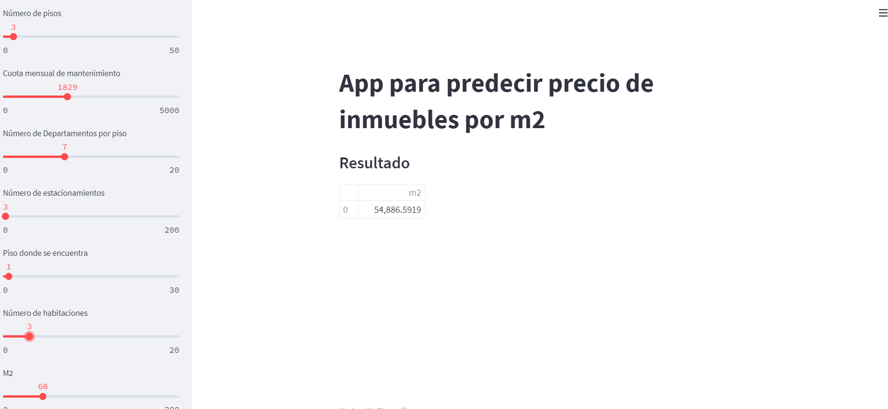

# Bienvenido a DD3-Challenge Repo🤓
**Introducción**

Dentro de este repo, encontrarás la estructura de trabajo y una breve explicación sobre eso.

## Información general


  

**Twitter: @juanhernandez9
Location: Zapopan, Jalisco**

## Estructura del repositorio

```
DD3-Challenge 
└───ds
|  |
|  │   challenge.ipynb
|  │   ds_config.py
|  |   reto_precios.csv
|  |   ddtres_data
|  |   requirements.txt
|  |   ml-app.py
|  |   modelo
|  |   app_d.png
|
────README.md
```

## Descripción de los archivos

|Archivo | Descripción|  
|-----------|:-----------:  
challenge.ipynb |  Jupyter notebook donde encontrarás el desarrollo del trabajo, análisis y conclusiones.    
ds_config.py | Clase dd3 que incluye algunos metodos estaticos para crear base de datos, permitir el acceso al motor de consultar de SQL y más sobre la conexión SQL. 
reto_precios.csv | Principal fuente de datos. 
ddtres_data |  Base de datos creada localmente. 
requirements.txt | Archivo de texto para llevar acabo instalación de dependencias.  
ml-app.py | Aplicación en la nube que estima el valor de la residencia por m2. 
modelo | Archivo formato pickle el cual contiene al modelo serializado. 
app_d.png | Ilustración del modelo en producción en aplicacion web local. 


# ¡Disfruta este proyecto!

**App interactiva.**


